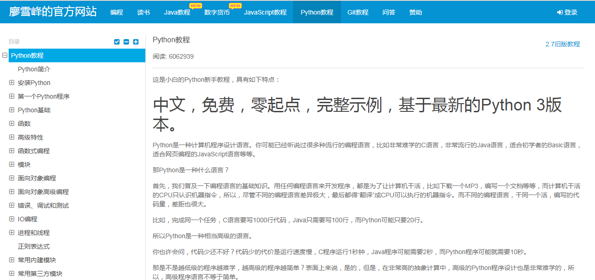

# Python 学习资源 

学习Python代码是一个兴奋，但有时候也会沮丧的过程。收集一些资源，供大家一起学习提高： 请大家多多贡献，包括有比较好的书和资料....

1. **Python官网**  

   追本溯源，必须从官网开始，当然你的英文要足够好，如果不是最好，略过....

   

   [Tutorial](https://docs.python.org/3/tutorial/index.html)

   

2. **菜鸟教程**

​       内容繁多，不仅仅是Python一项，关于Git，MySQL 都是我们现在要使用的，然后有空的话 正则，MongoDB，XML都很值得学习。

   

  	[Python教程](http://www.runoob.com/python3/python3-tutorial.html)

3. **廖雪峰的教程**

   非常经典的，也非常适合上手，比起菜鸟相对少一些，但是很经典！而且不仅仅是Python。向廖老师致敬

   

   [教程](https://www.liaoxuefeng.com/wiki/0014316089557264a6b348958f449949df42a6d3a2e542c000)

